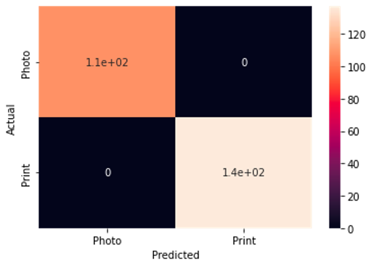

# Facial Detection and Recognition for Security Applications

This project is done by Ali Arefi-Anbarani, Ezgi Gumusbas and Yujin Lee. 

The report of this project can be found [here.]

The poster of this project can be found [here.]

## Introduction

Computer vision has many applications from a security standpoint. Facial recognition is one of the most common applications of computer vision. It is widely used for biometric identification. Face recognition is commonly used to unlock phones, access smart phone applications which contain personal information like bank apps, health record apps, etc., access to buildings such as offices and high-security facilities, to compare the passport photo with the holder’s face at the border checkpoints, to identify the criminal in the crowd, to give access to only authorized people in defense services as security precautions. 

## Problem

Although it might be more difficult to hack biometric identification than passwords in most cases, face recognition is still a challenging technology because it can be hacked in different ways.Facial spoofing is a popular risk of facial recognition systems. For example, if there isn't live video detection, it is a challenge to differentiate the people’s faces rather than photos of these people. Besides, sometimes it needs consistent lighting, positioning and resolution.

In this project, we focused on the photo spoofing method because it is widely used by the security systems and it is more easy to break the photo security than live methods like video. Most of the video and high-level live detection technologies are very expensive for the users. So, we want to focus on the cheapest and widely available one to find a solution to the spoofing problem and make a robust face detection system.

## Aim

Our aim in this project is to make a robust facial recognition system by using state of the art models to achieve high performance and solve the problem of spoofing. Our goal is to answer the question of how we can authenticate a user with high accuracy and detect the spoofing activities. 

## Data and Access 

The dataset contains headshot photos of people in the plain background from [Adobe stock](https://stock.adobe.com/search?k=passport+photos&search_type=usertyped ). The publicly open passport style photos were searched and the photos of people that is used for anti-spoofing part can be found [in this Drive folder.](https://drive.google.com/drive/folders/1EYGouovWZR1JJCD4Yts7MnSMMDO3ODu4?usp=share_link)

Data augmentation was applied to these photos and the augmented photos can be found [here](https://github.com/ezgigm/cyberdata_capstone/blob/main/dataset%20for%20anti-spoofing.zip) in this repo. The size of the photos are very big so 'zip' file was added to this repo. To use this augmented photos, it can be downloaded by clicking ‘view raw’ colored text on the page.

For ArcFace model, the test dataset contains headshot, half and full body shot photos of Chinese people in the various backgrounds from V3 dataset, and can be found [in this Drive folder.](https://drive.google.com/drive/folders/1Y8Ykn1fGMD9NmBSSyFeTHqSvKEb7Ru0h?usp=share_link) It can also be downloaded from the main source. The main source of the test dataset is [here](http://www.cbsr.ia.ac.cn/users/xiangyuzhu/projects/LBL/main.htm). The name of this data set is Public-Iv that is an IvS test dataset from BaiduBaike(owner) and official pages, containing 1,262 identities and 5,503 images. ArcFace is the pre-trained model, and the celebrity dataset used for training purposes. We didn't use this dataset directly because the model was already trained, but it can be found [here](http://mmlab.ie.cuhk.edu.hk/projects/CelebA.html) to see the photos. This celebrity data is prepared by The Chinese University of Hong Kong Multimedia Laboratory and it is available for non-commercial research purposes only.

## Methodology

1. Preprocessing

Stock images of passport-like photos were collected from adobe stock. To improve the reliability of the system we aimed to use as uniform photos as possible. We used uniform photos like a passport or driver license style with a plain background. Also, we gave importance to using the images that are the representative of all racial ethnicities. We wanted to use diverse data from the ethnicity perspective. Additionally, our dataset has a balance of genders and age groups. We used black and white prints because the LBP algorithm needs images to be in grayscale rather than color. Also, original color images were converted to greyscale. 

Original photo images were labeled as “Photo” and black-white printouts of original images were labeled as “Print”. Also, these print images needed to be resized to match the original photo pixel dimensions, so we resized them down by a factor of approximately 1000.  For example, the original dimensions of print photos were 4000 by 3200 pixels for each photo, at these dimensions, our LBP algorithm would be severely slowed down and thus pixels were resized to values between 300-400 by 300-400. The original Photo images were also in this range as well(300-400 by 300-400)

 2. Data Augmentation 
 
Data augmentation was performed to have a larger dataset, based on the principle that a larger dataset will better test the model. The techniques that we used:
Auto-enhancement or brightening of the image
+90 degree and  -90 degree rotations
Vertical and horizontal flips (flips image on x-axis and y-axis respectively)
For train dataset: 
Vertical and horizontal flips (flips image on x-axis and y-axis respectively)
+90 degree and  -90 degree rotations

These augmentation techniques helped us to have a larger dataset and give us a chance to test our algorithm in different ways like different angles and rotations. 

After augmentation the train and test set had 1093 images and 248 images respectively. This is an approximately 80% to 20% split of the total 1341 images. 

3. Local Binary Patterns (LBP)

We used local binary patterns to differentiate between original photos and printed images. Local binary patterns is a texture classifier based on a gray scale co-occurrence matrix that computes a local representation of texture in an image.

4. Histogram

After local binary patterns, we create feature vectors to see if there is a difference between the digital photo and the printed(paper). We plot them on the histogram to notice the difference. The LBP algorithm histogram gives us the frequency of the normalized features and we can see distinct features for each category. These histograms can be found in Results & Discussion sessions with detailed explanations. 

5. Lazy Prediction and LDA

We use lazy predict classification to do multiple classification models. We get 100% accuracy for certain models. So, to prevent overfitting, in this case we considered using K-fold cross validation to get a more accurate result. And, we performed k-fold cross validation to get a better understanding of the performance of our model.

One of the best performers was RidgeClassfiers, which is a classifier that uses ridge regression and the other was LinearDiscriminantAnalysis(LDA). Ridge regression uses a bias fit of line through the training data that produces less variance and the LDA model finds the direction of maximum class separation. Besides, LDA works to reduce variance like Ridge regression did.

6. Matching : ArcFace

Arcface is a state of the art method that uses a special loss function called Additive Angular Margin penalty, it will do the facial recognition ArcFace head with ResNet backbone, and a function that detect the distance between two images so that it can classify if the person is registered or not. We used ArcFace modeling to find the similarity between two faces to give an access to the user or not. The certain threshold is defined to let the user access with the similarity value. 

## Checkpoints

The checkpoint file can be found in this [Drive folder.](https://drive.google.com/drive/folders/1j0rRVoSuOvnCuP6bIaXP1XNnaaq_2sf4?usp=share_link)

## Findings 

### LBP

These figures show how the vector values of the images are distributed by frequency. X-axis represents the values of features of the vector and y-axis represents the frequency of them. 
As it is seen from the figures, the original images vector distribution is very different from printed images’ vector distribution. It proves that LBP did a good job on texture differences. Although the distribution of feature values between 0.0 and 0.1 looks similar, the right side of the distribution is totally different. In real images, the right side tail is distributed between 0.2-0.3, but in the printed photos, the right tail is distributed between 0.4-0.5 mostly. This gives a distinct separation of original images and printed photos. Photos vs print observations are well separated in the feature space. 

### t-SNE

From these observations, we can see the clear clustering as expected, especially in the training set, this is with maximum perplexity and we got similar results from lower perplexity values. In this chart, blue points represent the print photos and orange points represent the original photos and except a few points the distinction between the oranges and blues are very clear in training data. X and y axis show the dimensions 1 and 2, respectively. In test data, although it is not as clear as the training data, there are still distinct points that blues are in the upper portion and oranges are in the lower portion of the invisible separation line. 

### LDA

Confusion matrix shows the actual and predicted results of the model. False positives and false negatives can be seen from the confusion matrix easily. In our results, it is seen that LDA on the test set predicts all photos as photo and predicts all prints as print in the test. 

Normally, when we get a 100% accuracy on a train set, it might be considered to be overfitting, but in this project it can be 100% accuracy on a test set, because we checked the projection of our data and there was already a distinct separation between feature vectors of photos and prints. So, the prints and photos can be predicted perfectly. Also, LDA projections maximize the distances between different classes, it does this by maximizing the component class axes for class separation. In other words, it gets a more separate distribution between the classes on that axis. So, it performed well in this project. 

## Future Improvements

- To improve the reliability of the model, video detection can be used.
- Another option that might work very well is the combination of anti-spoofing solutions such that eye blink detection can be added to LBP, and the combination of these two methods will be used. Active flash also might be added to this combination to make it more strong. 
- Although we used as uniform photos as possible, the unnecessary artifacts in the images can also cause overfitting and reduce the reliability of the system. To improve the reliability of the system, we can improve the uniformity of the data sets. We can work on the balance of the detailed artifacts in train and test sets. 
- We can work to improve the randomization of the splitting to address that the accuracy of the test set is higher than the accuracy of the train set.
- Another future work might be the demo web app to represent the project in application and to show the connection between anti-spoofing and ArcFace modeling output. 
- For the ArcFace model, fine-tuning on more data can be done for future work, specifically on Asian faces. Because, pre-trained ArcFace is trained on celebrities data and the majority of the data contains American celebrity faces. So, if the model will be fine-tuned on more Asian faces, the accuracy of the results might increase. 
- Also future work should include use of inkjet printers as inkjets can have dpi of up to 5000 dpi as of date, this will better test the performance of the model. More greyscale data augmentation techniques like 45 degree rotations or random degree rotations, as well as shifting augmentation should be applied to increase the dataset.

## Repository Guide & How to Use This Repo

### Reproduction:

1. Download the adobe stock photos and Chinese people's test data from the drive that is given and explained in detail in the Data and Access session. 
2. Clone this repo (for help [see this tutorial.](https://docs.github.com/en/repositories/creating-and-managing-repositories/cloning-a-repository))
3. Open the 'zip' file of the augmented images. 
4. Install the required libraries. (written in 'requirements.txt' in this repo)
5. Run the [Texture_classifier_for_Print_or_Photo.ipynb](https://github.com/ezgigm/cyberdata_capstone/blob/main/Texture_classifier_for_Print_or_Photo.ipynb) notebook for anti-spoofing part. 
6. Run the [Arcface_modeling.ipynb](https://github.com/ezgigm/cyberdata_capstone/blob/main/Arcface_modeling.ipynb) for the ArcFace model. 

### Repository Guide

- #### Augmented Data for Anti-Spoofing 
  
  It can be found [here.](https://github.com/ezgigm/cyberdata_capstone/blob/main/dataset%20for%20anti-spoofing.zip)

- #### Notebooks

  [Anti-spoofing](https://github.com/ezgigm/cyberdata_capstone/blob/main/Texture_classifier_for_Print_or_Photo.ipynb)

  [ArcFace](https://github.com/ezgigm/cyberdata_capstone/blob/main/Arcface_modeling.ipynb)

- #### Deliverables

  [Blog post of this project]

  [Poster]

- #### Pre-trained ArcFace Model with its Licences
   The code is reused from an open source project, so the original repo of the ArcFace model can be found [here.](https://github.com/ezgigm/cyberdata_capstone/tree/main/arcface-tf2)

- #### For the reqirements of Reproduction
  [Requirements](https://github.com/ezgigm/cyberdata_capstone/blob/main/requirements.txt)

